#  DAY 2

## Hierarchical vs Flat synthesis and efficient flop coding styles

### Hierarchical Design

A Hierarchical Design contains of multiple sub-modules,instantiated in the 'top' module.

Hierachical design approach is taken for large designs, to gain the advantage of divide and conquer approach. This leads to better utilization of tool resources for proper optimzation of smaller designs,as a larger design is difficult for a tool to optimize efficiently.

It helps in better utilization of compute resources utilized during design process,and also leads to faster runtime and debugging operations.

### Flat Design

A flat design approach is chosen when the design is sufficiently small enough for the tool to optimize efficiently in a reasonable amount of time.

For small and simple ASICs flat approach is preferable while hierarchical approach is preferable for larger,complex ASICs.

A flat design is a representation where all hierarchical module structures are collapsed into a single level, eliminating submodules and integrating their logic directly into the top-level module.

### Design of Multiple Modules


### Hierarchical Flow:
##### commands:
```bash
yosys
read_liberty -lib ~/sky130RTLDesignAndSynthesisWorkshop/lib/sky130_fd_sc_hd__tt_025C_1v80.lib
read_verilog multiple_modules.v
synth -top multiple_modules
abc -liberty ~/sky130RTLDesignAndSynthesisWorkshop/lib/sky130_fd_sc_hd__tt_025C_1v80.lib
write_verilog -noattr multiple_modules.v
```
It is used to preserve hierarchy.

Top Module: multiple_modules

Sub Modules: sub_module1, sub_module2


### Flattened Flow:
#### commands
```bash
$ flatten
$ write_verilog -noattr multiple_modules_flat.v
```


## D  Flip-Flop with Async Reset

It captures the input d on the rising edge of the clock, unless the asynchronous reset is activated.

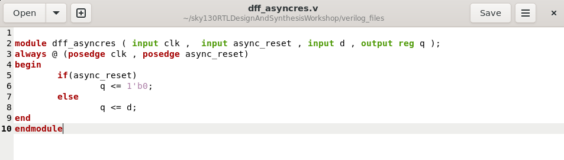

In the dff_asyncres module, the asynchronous reset has higher priority than the clock.
async_reset is checked first, so if it is high (1), it immediately resets q to 0.

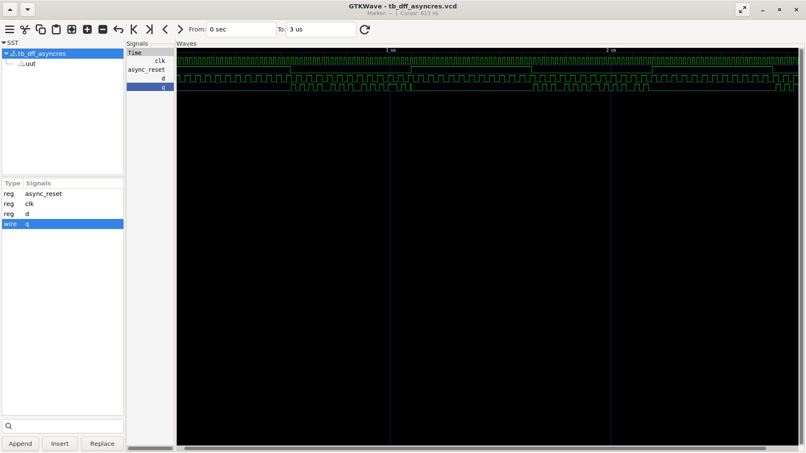

## D  Flip-Flop with Async set

It captures input d on the rising edge of the clock, unless the asynchronous set is active.

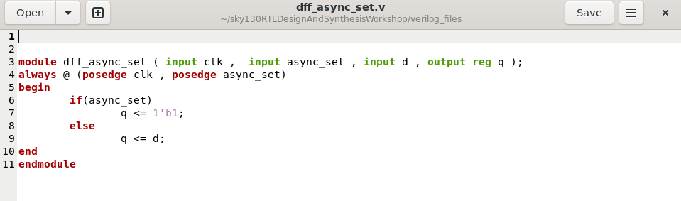

The flip-flop responds to either the positive edge of clk or async_set.
If async_set is high, the output q is immediately set to 1, regardless of the clock.

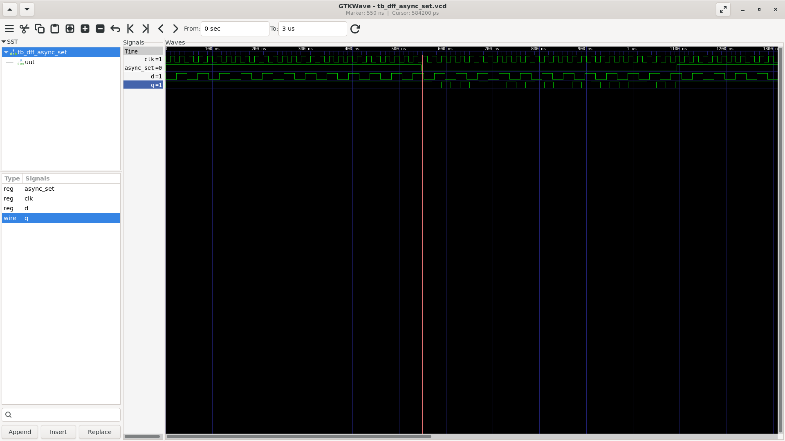

## D  Flip-Flop with sync reset

The flip-flop captures the value of d on the rising edge of the clock, unless the synchronous reset is active.

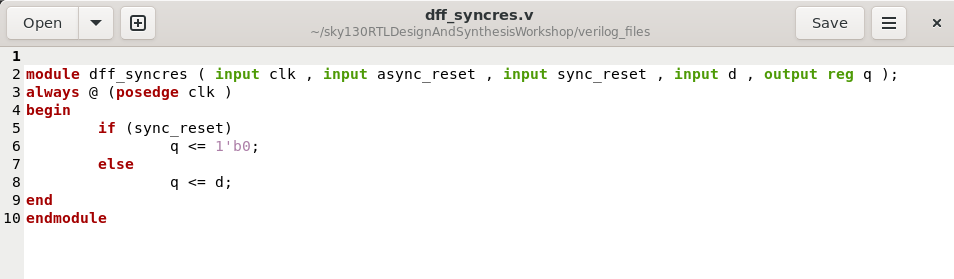

The always block triggers only on the rising edge of the clock.

If sync_reset is high at the time of the clock edge, the output q is set to 0.

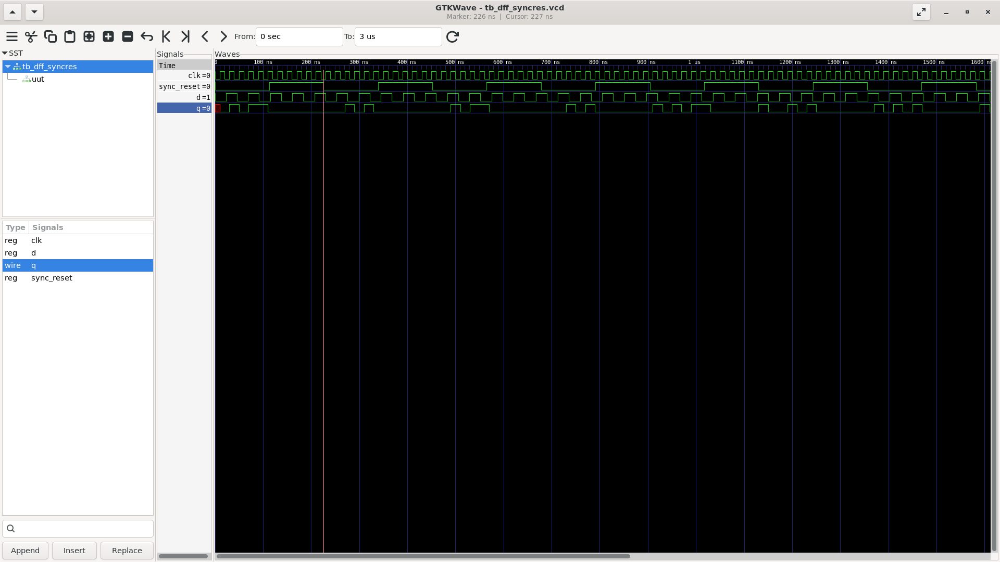

## Synthesis of D Flip-Flop with Asynchronous set

```bash
$ yosys
$ read_liberty -lib ~/sky130RTLDesignAndSynthesisWorkshop/lib/sky130_fd_sc_hd__tt_025C_1v80.lib
$ read_verilog dff_async_set.v
$ synth -top dff_async_set
$ dfflibmap -liberty ~/sky130RTLDesignAndSynthesisWorkshop/lib/sky130_fd_sc_hd__tt_025C_1v80.lib
$ abc -liberty ~/sky130RTLDesignAndSynthesisWorkshop/lib/sky130_fd_sc_hd__tt_025C_1v80.lib
$ show
```
Note:

abc -liberty <.lib file path> : This command is used for for technology mapping of yosys’s internal gate library to a target architecture.

synth -top <module_name> : This command runs the yosys synthesis script on the mentioned module name of our design

dfflibmap -liberty <.lib file path> : This command maps internal flipflop cells to the flipflop cells in the technology library specified in the given liberty file.

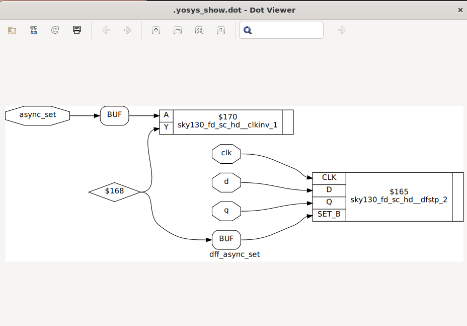

## Synthesis of D Flip-Flop with Asynchronous reset

```bash
$ yosys
$ read_liberty -lib ~/sky130RTLDesignAndSynthesisWorkshop/lib/sky130_fd_sc_hd__tt_025C_1v80.lib
$ read_verilog dff_async_set.v
$ synth -top dff_async_set
$ dfflibmap -liberty ~/sky130RTLDesignAndSynthesisWorkshop/lib/sky130_fd_sc_hd__tt_025C_1v80.lib
$ abc -liberty ~/sky130RTLDesignAndSynthesisWorkshop/lib/sky130_fd_sc_hd__tt_025C_1v80.lib
$ show
```

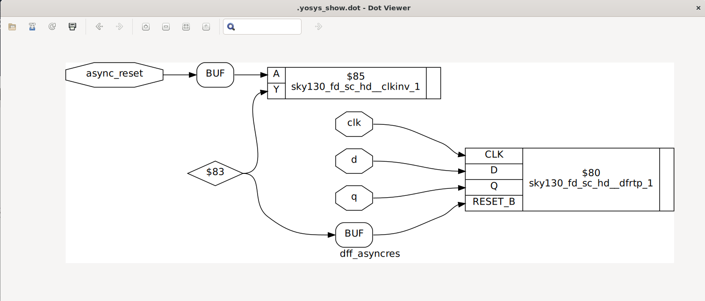

## Synthesis of D Flip-Flop with synchronous reset

```bash
$ yosys
$ read_liberty -lib ~/sky130RTLDesignAndSynthesisWorkshop/lib/sky130_fd_sc_hd__tt_025C_1v80.lib
$ read_verilog dff_async_set.v
$ synth -top dff_async_set
$ dfflibmap -liberty ~/sky130RTLDesignAndSynthesisWorkshop/lib/sky130_fd_sc_hd__tt_025C_1v80.lib
$ abc -liberty ~/sky130RTLDesignAndSynthesisWorkshop/lib/sky130_fd_sc_hd__tt_025C_1v80.lib
$ show
```

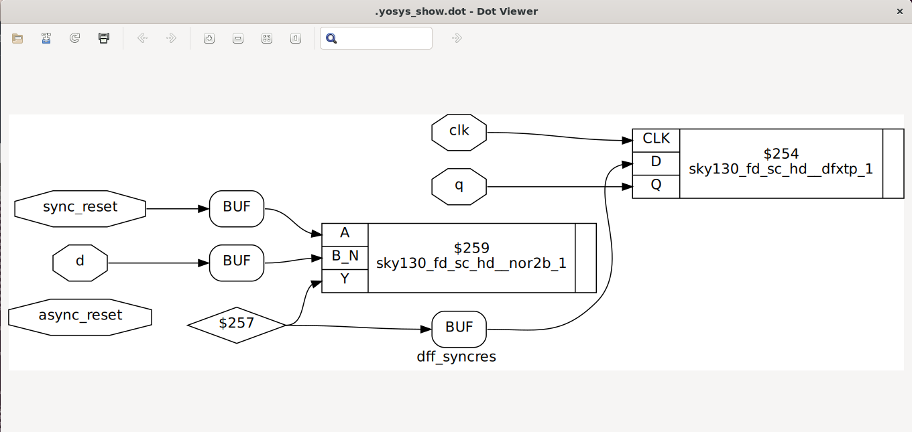

## Optimisations
Optimization in synthesis refers to simplifying the RTL logic to make the design more efficient. 

## Part1 - Synthesis of MULT2
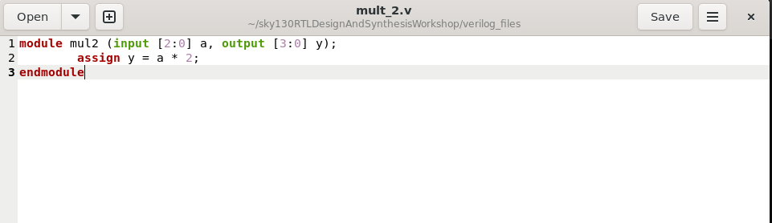
```bash
yosys
read_liberty -lib ~/sky130RTLDesignAndSynthesisWorkshop/lib/sky130_fd_sc_hd__tt_025C_1v80.lib
read_verilog mult_2.v
synth -top mult_2
abc -liberty ~/sky130RTLDesignAndSynthesisWorkshop/lib/sky130_fd_sc_hd__tt_025C_1v80.lib
write_verilog -noattr mult_2_net.v
```
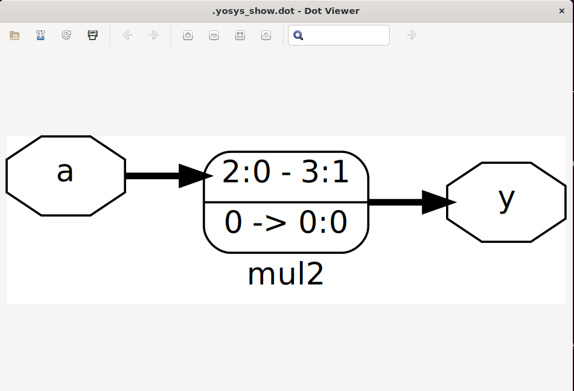

## Part2 - Synthesis of mult8
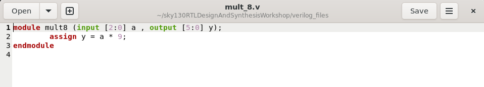
```bash
yosys
read_liberty -lib ~/sky130RTLDesignAndSynthesisWorkshop/lib/sky130_fd_sc_hd__tt_025C_1v80.lib
read_verilog mult_8.v
synth -top mult8
abc -liberty ~/sky130RTLDesignAndSynthesisWorkshop/lib/sky130_fd_sc_hd__tt_025C_1v80.lib
write_verilog -noattr mult_8_net.v
```
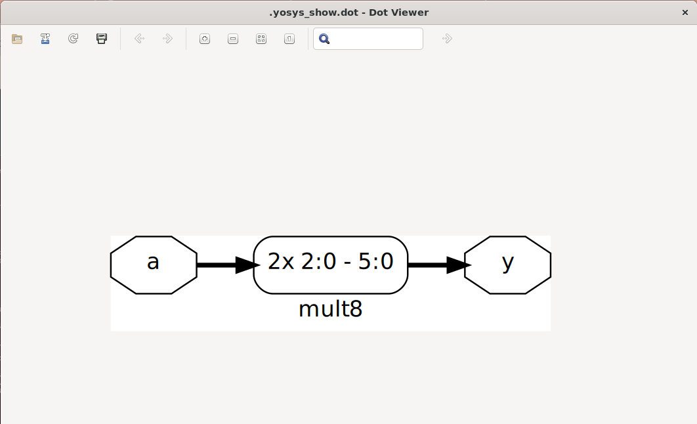
