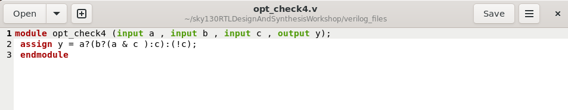
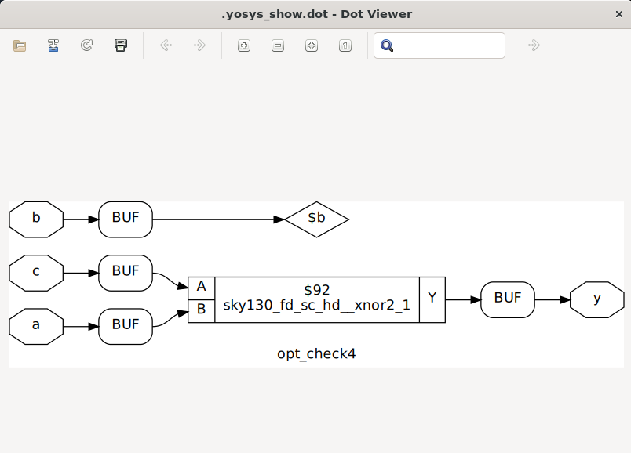
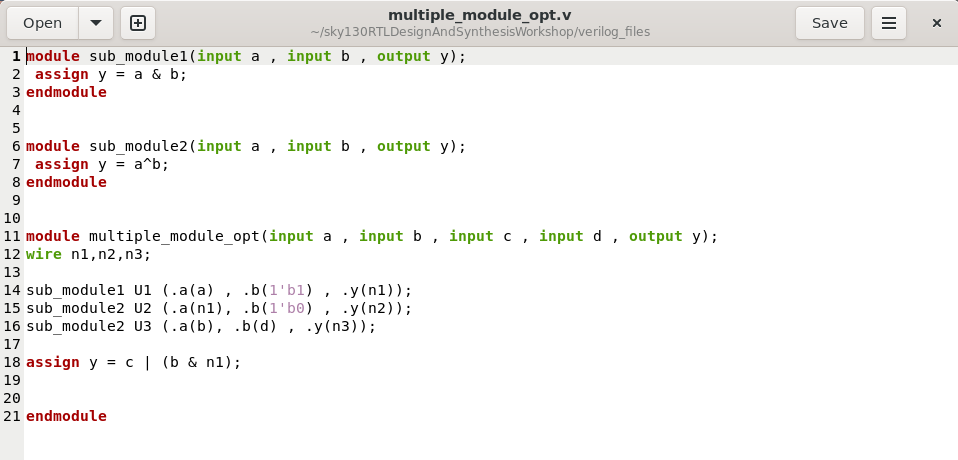
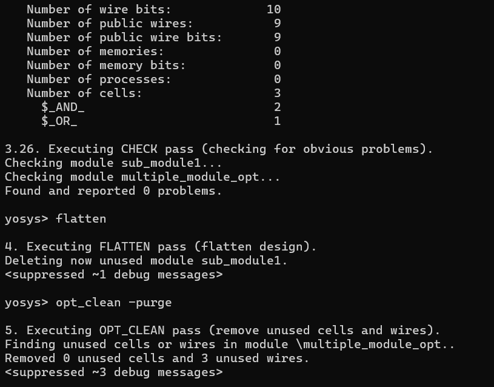
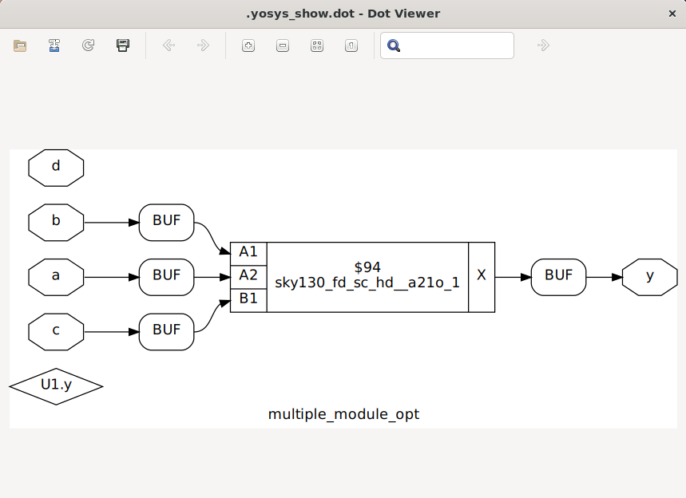
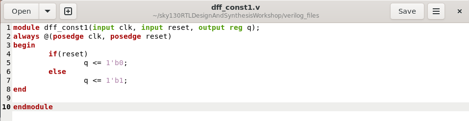
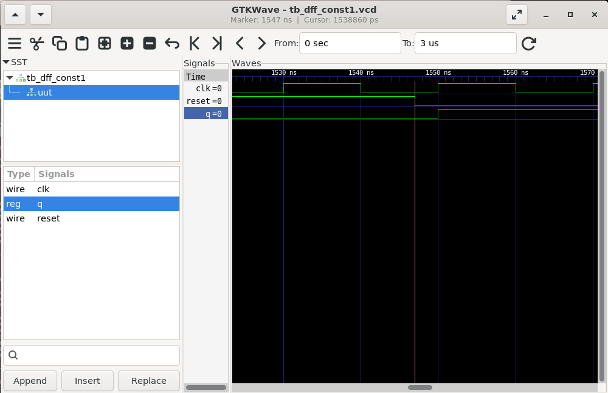
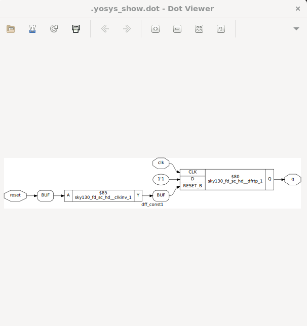
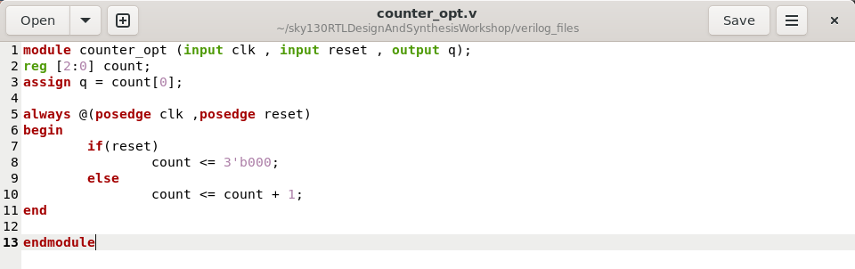
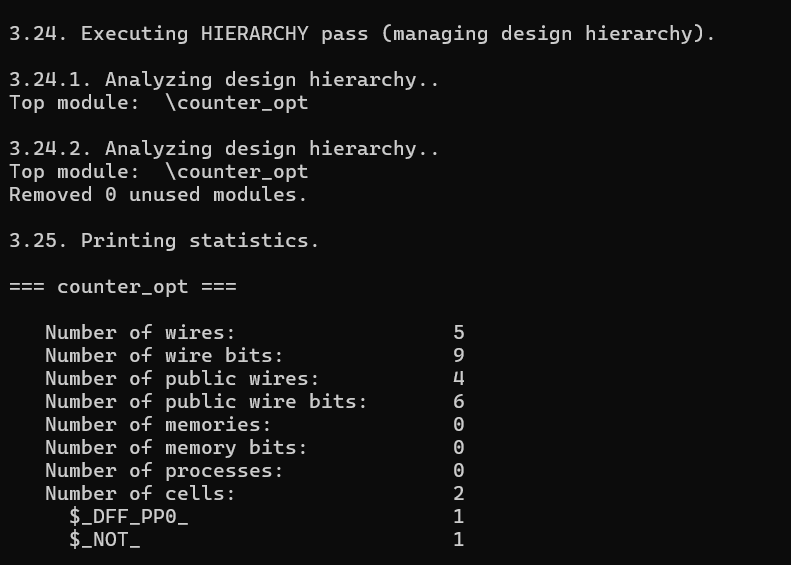

#  DAY 3

## Logic Optimization

Logic optimization in VLSI is the process of improving a digital circuit’s design to minimize area, delay, and power consumption while preserving its functionality. It is a crucial step in the synthesis phase of VLSI design before physical implementation.

## Objectives of Logic Optimization
1. Minimize Area: Reduce the number of gates and interconnections.

2. Minimize Delay: Shorten the critical path to improve circuit speed.

3. Minimize Power: Reduce switching activity and capacitance.

4. Improve Reliability: Simplify design to reduce glitches and hazards.

5. Reduce Fabrication Cost: Smaller circuits cost less and are easier to manufacture.

## Types of Optimization 

#### Boolean-Level Optimization:
Simplify Boolean expressions to reduce the number of gates.

##### Techniques of Boolean-Level Optimization:

-Algebraic simplification: Using Boolean algebra rules.
-Karnaugh Maps (K-map): Manual simplification for small circuits.
-Quine–McCluskey method: Systematic tabular method for larger circuits.
-Espresso algorithm: Heuristic algorithm for large combinational circuits.

#### Gate-Level (Structural) Optimization:
Optimize the arrangement and type of gates for area, delay, and power.

##### Techniques of Gate-Level (Structural) Optimization:

-Gate Restructuring: Rewriting logic using alternative gate combinations.
-Technology Mapping: Converting logic to gates available in the target library.
-Common Subexpression Elimination: Sharing repeated logic to save area.

#### Technology-Dependent Optimization
Optimize for a specific technology (CMOS, TTL, FPGA, ASIC).

##### Techniques of Technology-Dependent Optimization:

-Gate sizing: Adjust transistor sizes for delay/power tradeoff.
-Buffer insertion: Reduce signal propagation delay.
-Fan-out optimization: Minimize load on critical paths.

#### Delay (Performance) Optimization
Minimize critical path to improve speed.

##### Techniques of Delay (Performance) Optimization:
-Logic restructuring to balance paths.
-Pipeline insertion for high-speed circuits.
-Parallel execution of independent logic blocks.

#### Power Optimization
Reduce dynamic and static power consumption.

##### Techniques of Power Optimization:

-Reducing switching activity.
-Clock gating.
-Using low-power logic styles (e.g., pass-transistor logic).

#### Redundancy Removal
Remove logic that does not affect outputs.

##### Techniques of Redundancy Removal:

-Detect and eliminate redundant gates or terms.
-Use SAT-based or BDD-based methods to identify redundancies.

#### High-Level Optimization (Behavioral/RTL)
Optimize logic during RTL synthesis before gate-level mapping.

##### Techniques of High-Level Optimization:

-Strength reduction (replace expensive operations with cheaper ones, e.g., multiplication → shift-add).
-Resource sharing (reuse hardware for multiple operations).
-Loop unrolling and pipelining in sequential circuits.

## Optimization commands:
```bash
$ opt_clean -purge
```

### Combination Logic Optimization


```bash
yosys
read_liberty -lib ~/sky130RTLDesignAndSynthesisWorkshop/lib/sky130_fd_sc_hd__tt_025C_1v80.lib
read_verilog opt_check4.v
synth -top opt_check4
abc -liberty ~/sky130RTLDesignAndSynthesisWorkshop/lib/sky130_fd_sc_hd__tt_025C_1v80.lib
opt_clean -purge
write_verilog -noattr opt_check4.v
```



#### Multiple module optimization





### Sequential Logic Optimizaton

```bash
$ yosys
$ read_liberty -lib ~/sky130RTLDesignAndSynthesisWorkshop/lib/sky130_fd_sc_hd__tt_025C_1v80.lib
$ read_verilog dff_const1.v
$ synth -top dff_const1
$ dfflibmap -liberty ~/sky130RTLDesignAndSynthesisWorkshop/lib/sky130_fd_sc_hd__tt_025C_1v80.lib
$ abc -liberty ~/sky130RTLDesignAndSynthesisWorkshop/lib/sky130_fd_sc_hd__tt_025C_1v80.lib
$ opt_clean -purge
$ write_verilog -noattr dff_const1_net.v
```





### Sequential Optimization for Unused cells

