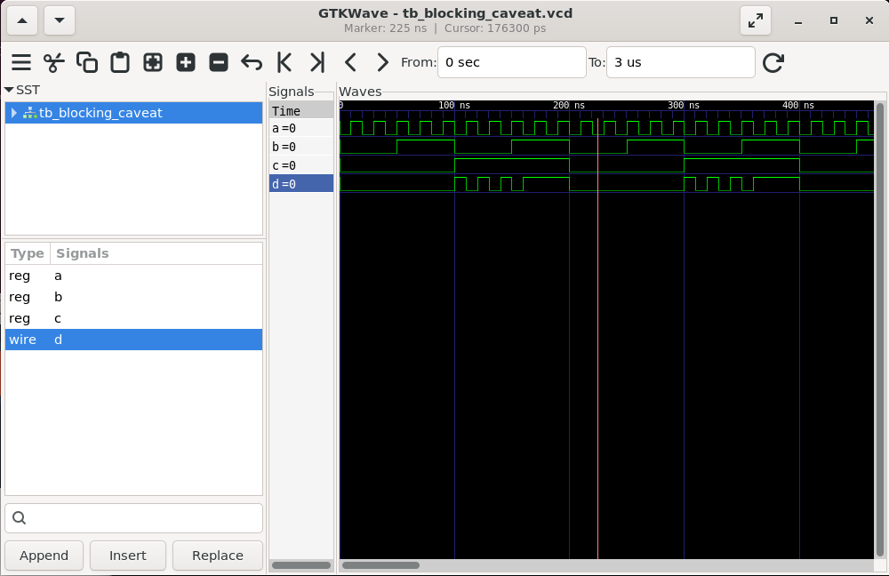

#  DAY 4

## Synthesis Simulation Mismatches

A Synthesis–Simulation Mismatch (SSM) happens when the behavior of a digital circuit in pre-synthesis simulation (RTL simulation) does not match the behavior of the same circuit after synthesis (gate-level netlist simulation.

## Causes of Synthesis–Simulation Mismatch

1. Incomplete Sensitivity List (in Verilog/VHDL):

    - In RTL simulation, if a signal in the sensitivity list is missing, the simulator may not update the output correctly.

    - But synthesis assumes combinational logic and updates automatically.

2. Blocking vs Non-Blocking Assignments:

    - Incorrect use of = (blocking) vs <= (non-blocking) can cause different behavior.

    - RTL sim may appear correct but synthesized hardware may behave differently.

3. Latch Inference (Unintended):

    - Missing else or default conditions in combinational logic leads to latches.

    - Simulators may show stable results, but synthesized design has unintended storage.

4. Initialization Differences:

    - RTL simulators often initialize registers to X or 0, depending on the simulator.

    - Hardware (post-synthesis) does not automatically initialize registers unless reset logic is provided.

5. Timing-Related Issues:

    - RTL simulation assumes zero delay.

    - Gate-level simulation considers propagation delays, causing glitches/hazards not seen in RTL.

6. Unsupported Constructs:

    - Some RTL code (like initial, #delay, file I/O) is valid for simulation but ignored during synthesis.

##  How to Avoid SSM

1. Always write synthesizable RTL code.

2. Use complete sensitivity lists (always @(*) in Verilog).

3. Use non-blocking assignments (<=) for sequential logic.

4. Provide proper reset logic for registers.

5. Avoid non-synthesizable constructs (initial, #delay, fork-join).

6. Run linting tools and synthesis checks before gate-level simulation.

## Synthesis-Simulation Mistmatch Example 1
### verilog

### Waveform before Synthesis

### Synthesised Diagram

### Waveform after Synthesis

## Synthesis-Simulation Mistmatch Example 2
### verilog

### Waveform before Syntesis

### Synthesised Diagram

### Waveform after Synthesis

