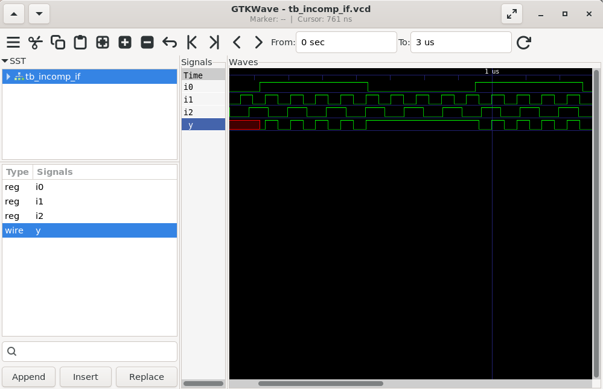
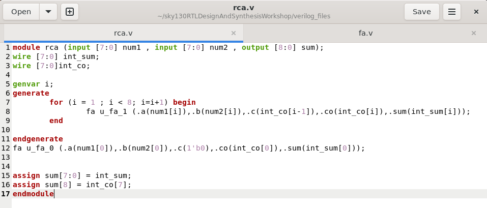

#  DAY 5

## if Construct

- The if statement is a conditional construct used to make decisions in Verilog.

- It checks conditions and executes the corresponding block of code.

- Can be nested or combined with else and else if.

### Syntax

```bash
$ if (condition)
$    statement1;
$ else if (condition2)
$    statement2;
$ else
$    statement3;
```
### Key Points:

- Use if-else when checking ranges or multiple conditions.

- Missing else may infer a latch in synthesis.

- Works well for priority-based decisions (one condition has higher priority).

### Incomple "if" Example

#### Verilog code


#### Cautions


#### Waveform



#### Synthesised Diagram


## Case Construct

- The case statement is a multi-way branching construct.

- It compares an expression with multiple possible values and executes the matching branch.

### Syntax

```bash
$ case (expression)
$    value1: statement1;
$    value2: statement2;
$    default: statement_default;
$ endcase
```
### Key POints
- Use case when checking discrete values of a signal (like mux, FSM states).

- Always include a default case to avoid latch inference.

- Variants:

    - casez → Treats z or ? as don’t-care.

    - casex → Treats both x and z as don’t-care. (⚠ not recommended in synthesis due to ambiguity).

### Incomplete case Example

#### Verilog code

[!incomplete_case](images/incomp_case_verilog.png)

#### Waveform

[!incomplete_case_wave](images/wave_incomp_case.png)

#### Caution

[!incomplete_case_caution](images/incomp_case_caution.png)

#### Synthesized Diagram

[!incomplete_case_syn](images/incomp_case_syn_diag.png)

### Partial Case Construct Example

#### Verilog 

[!partial_case_verilog](images/partial_case_verilog.png)

#### Waveform

[!partial_case_wave](images/wave_partial_case.png)

#### Caution

[!partial_case_caution](images/partial_case.png)

#### Synthesized Diagram

[!partial_case_syn_diag](images/partial_case_syn_diag.png)

### Bad case Example

#### Verilog


#### Waveform


#### Caution


#### Synthesized Diagram


### Complete case Example

#### Verilog


#### Waveform


#### Synthesized Diagram


## Looping Constraint

### for Loop

- A procedural loop used inside always or initial blocks.

- Executes sequentially in simulation time (not parallel hardware).

- Useful for testbenches or repeated assignments inside procedural blocks.

### Syntax

```bash
$ for (init; condition; update) begin
$     // procedural statements
$ end

```
### Key Points

- Used inside procedural blocks (always, initial).

- Executes sequentially during simulation.

- Does not replicate hardware automatically.

### for Loop Example (mux)

#### Verilog

[!for_loop_ver](images/mux_generate_using_for_verilog.png)

#### Waveform

[!for_loop_wave](images/wave_mux_generate.png)

#### Synthesized Diagram


### for - generate (RCA)

#### Verilog



#### Waveform


#### Synthesized Diagram

