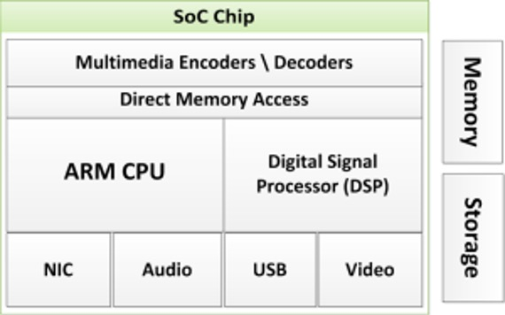

#  SoC

A System-on-Chip (SoC) is an integrated circuit (IC) that combines most or all components of a computer or electronic system onto a single chip.
Instead of having separate chips for processor, memory, and peripherals, an SoC integrates them all into one silicon die.

## Components in SoC

1. Processor:
    - General-purpose processor (ARM, RISC-V, MIPS, x86 in rare cases).
    - Handles the main computational tasks.
2. Graphics Processor (GPU)
    - Specialized core for graphics rendering and parallel computing.
    - Essential for smartphones, tablets, and gaming devices.
3. Digital Signal Processor (DSP)
    - Optimized for audio, image, video, and real-time signal processing.
4. Memory
    - On-chip SRAM (cache)
    - Interfaces for external DRAM, Flash, or ROM
5. I/O Interfaces
    - USB, HDMI, Ethernet, PCIe, SPI, I²C, UART, CAN bus, etc.
6. Analog/Mixed-Signal Blocks
    - ADC/DAC (convert analog to digital and vice versa).
    - RF circuits for wireless communication (Wi-Fi, Bluetooth, LTE, 5G).
7. Power Management Unit (PMU)
    - Voltage regulators, clock management, low-power states.
8. Security Modules
    - Hardware accelerators for encryption/decryption.
    - Trusted Execution Environments (TEE).

##  Types of SoC

1. Application SoCs
    - Found in smartphones, tablets, smart TVs.
    - Example: Qualcomm Snapdragon, Apple A-series, MediaTek.
2. Communication SoCs
    - For routers, networking devices.
    - Example: Broadcom SoCs in Wi-Fi routers.
3. Automotive SoCs
    - For ADAS (Advanced Driver Assistance Systems), EVs, infotainment.
    - Example: NVIDIA DRIVE, Tesla FSD chip.
4. IoT SoCs
    - Low power, wireless connectivity, small form factor.
    - Example: ESP32, Nordic nRF52840.
5. Custom ASIC SoCs
    - Designed for special applications (AI accelerators, cryptocurrency mining).
    - Example: Google TPU, Tesla Dojo D1.

## Advantages of SoC:

- Compact size → all-in-one chip.
- Lower power consumption (optimized integration).
- Lower cost (fewer chips, reduced PCB area).
- Higher performance (shorter interconnects, optimized communication).
- Customizability (AI SoCs, automotive SoCs).

## Challenges in SoC Design
- Complexity: Billions of transistors.
- Verification: Ensuring bug-free design is very hard.
- Power management: Balance performance and efficiency.
- Security risks: Hardware Trojans, backdoors.
- High NRE (Non-Recurring Engineering) cost: Expensive to design/fabricate.

# BabySoC

BabySoC project that is used as a teaching and training model for people who want to learn how real SoCs are designed, verified, and implemented.
It’s called “Baby” because it is much smaller and simpler than commercial SoCs (like Snapdragon, Apple A-series, NVIDIA Orin), but it still demonstrates the core principles of SoC design.

## Why BabySoC is a Simplified Model for Learning SoC Concepts ?

The VSDBabySoC is intentionally designed as a minimal SoC so that learners can understand all major concepts of SoC design without being overwhelmed by the complexity of a commercial SoC (like Snapdragon or Apple A-series).

### Small CPU Core (RISC-V based)

- Instead of a superscalar, multi-core, out-of-order CPU, BabySoC uses a very small single-core, in-order RISC-V processor.
- This keeps the instruction set and datapath simple.

### Minimal Peripherals

- Only essential blocks like GPIO, UART, and Timer are included.
- Avoids complexity of Ethernet, PCIe, GPU, or DSP.

### Tiny Memory Subsystem

- Uses a small SRAM or behavioral Verilog memory model.
- No caches, MMU, or virtual memory complexity.

### Simplified Interconnect

- Uses a lightweight bus like Wishbone or AXI-lite.
- Commercial SoCs may use complex NoC (Network-on-Chip).

### Lower Technology Node (130nm SkyWater PDK)

- Easy to fabricate in MPW shuttles, avoids FinFET/7nm complications.

### Educational Focus

- The goal is not maximum performance, but maximum clarity of concepts.
- Students learn RTL → Synthesis → PnR → GDSII end-to-end on a manageable scale.

## Why is Functional Modelling Important ?

1.	Specification Validation

- Helps check system requirements before spending effort on RTL.
- Example: Does the CPU fetch → decode → execute instructions properly?

2.	Early Debugging

- Errors at functional level are easier and cheaper to fix than at RTL or layout stage.
- Example: Testing instruction set behavior before coding RTL pipeline.

3.	Performance Exploration

- Lets you try different architectures quickly (e.g., bus vs NoC, memory sizes).
- You can run simulations and compare speed, power, and area before committing to RTL.

4.	Reference Model for Verification

- A golden functional model can be used to check RTL outputs.
- Example: If RTL CPU gives wrong ALU result, compare against functional model.

5.	Bridging Software ↔ Hardware

- Software teams can start developing firmware on the functional model even before the chip exists.
- This shortens time-to-market.

## How BabySoC is Designed ?

1.	Functional Modeling

- High-level behavioral description (Python/SystemC/Verilog behavioral model).
- Tests if the CPU and SoC architecture works logically.

2.	RTL Design (Verilog)

- Write synthesizable Verilog modules for CPU, memory, bus, peripherals.
- Example: ALU, Register File, Instruction Decoder.

3.	Simulation & Verification

- Run testbenches in Icarus Verilog/Verilator.
- Ensure instructions execute correctly.

4.	Synthesis (Yosys)

- Convert RTL to gate-level netlist.

5.	Physical Design (OpenLane/OpenROAD)

- Floorplanning, placement, routing.
- Generate chip layout (GDSII).

6.	DRC/LVS Checks (Magic/Netgen)

- Verify layout matches circuit and meets fabrication rules.

7.	Tape-out (Fabrication)

- Can be sent to SkyWater 130nm foundry using open shuttle programs.

## SoC Architecture Image

