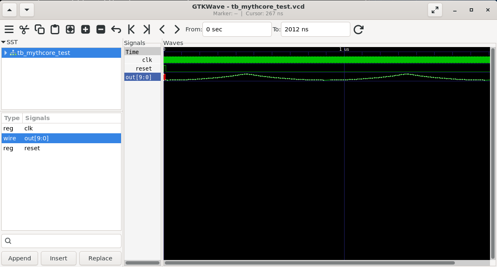
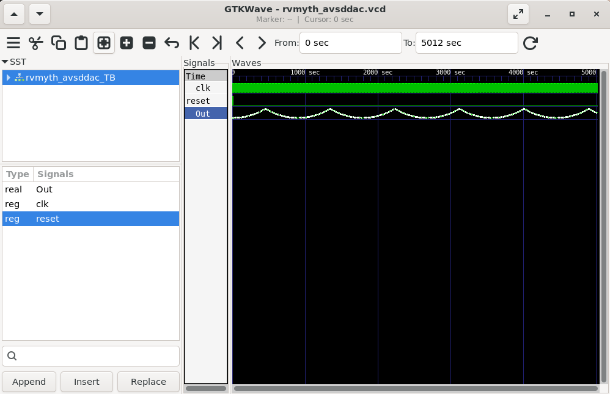
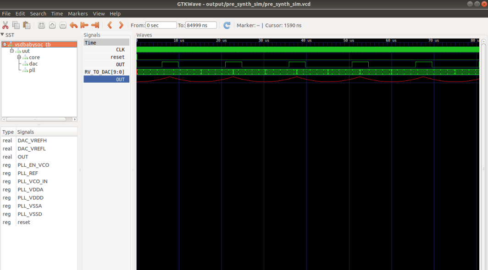
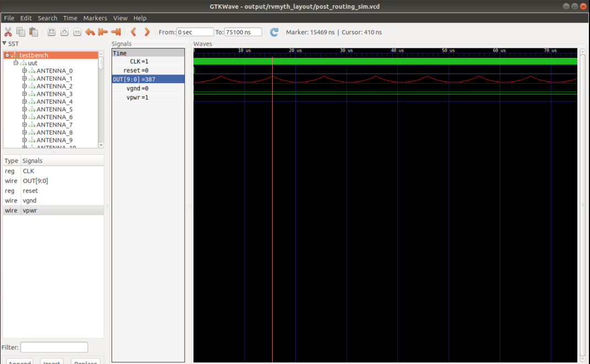

# OpenLane

OpenLane is an open-source, automated RTL-to-GDSII flow for digital integrated circuit design.
It’s built on top of tools like:
- Yosys – synthesis
- OpenROAD – floorplanning, placement, CTS, routing
- Magic / KLayout – DRC/LVS checking
- Netgen – LVS
- OpenSTA – static timing analysis

It takes Verilog RTL as input and produces GDSII (the layout file sent for fabrication).

### rvmyth core simulation output

### avsdac simulation output

### rvmyth_avsdac Pre-Routing simulation output

### rvmyth_avsdac Post-Routing simulation output

### VSDBabySoC Top Module Simulation Output

